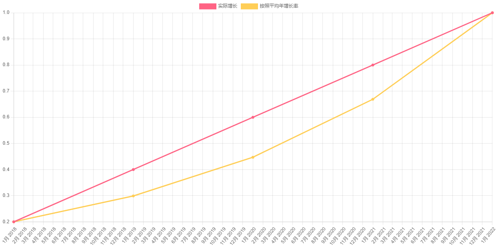

# chartjs-demo

一个计算收入复合年增长并生成图表的网页，输入 json 数据并获得一个可共享的 url。

> 分享的 url 中仅包含时间信息，具体数值会被转换。

示例 json 如下

```json
[
  { "time": "2018-01", "value": 1 },
  { "time": "2019-01", "value": 2 },
  { "time": "2020-01", "value": 3 },
  { "time": "2021-01", "value": 4 },
  { "time": "2022-01", "value": 5 }
]
```

生成的图标


